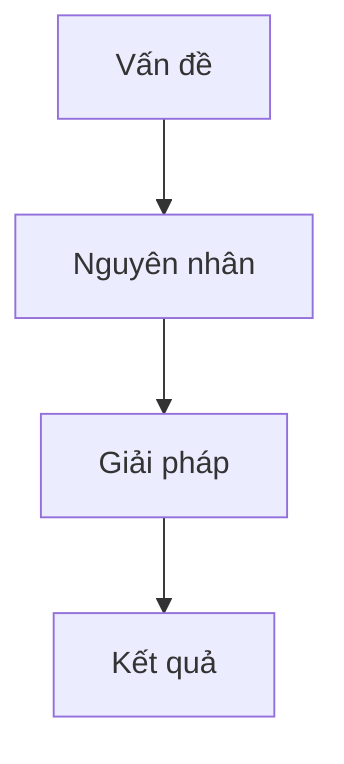

<details>
<summary>📌 Meta · ID: GU-001</summary>

<br>

> **Tác giả:** ThuongDev
>
> **Ngày tạo:** 2026-07-10  
> **Cập nhật:** 2026-07-11
>
> **Ngữ cảnh:** Cấu trúc hệ thống tài liệu  
> **Trạng thái:** Đang hoạt động  
> **Thẻ:** #system #structure  

</details>

# Quy tắc tổ chức thư mục

Nội dung được chia thành các thư mục chính nhằm lưu trữ quá trình phát triển, suy nghĩ, quyết định và kiến thức được hình thành trong quá trình làm việc.

Các thư mục không chỉ dùng để lưu trữ thông tin, mà còn phản ánh cách một con người suy nghĩ và phát triển một dự án:

* **Hành trình** ghi lại dòng thời gian và câu chuyện phát triển.
* **Quyết định** ghi lại những lựa chọn quan trọng cùng lý do phía sau.
* **Giải pháp** ghi lại cách xử lý các vấn đề đã gặp.
* **Chiến lược** ghi lại những định hướng và kế hoạch dài hạn.

Mục tiêu của hệ thống là giữ lại không chỉ **kết quả cuối cùng**, mà còn cả **quá trình suy nghĩ dẫn đến kết quả đó**.

---

# 1. Hướng dẫn

## Mục đích

Thư mục **Hướng dẫn** chứa các tài liệu hướng dẫn, quy tắc và thông tin chung về hệ thống.

Đây là nơi dành cho những nội dung:

* Không thuộc riêng một dự án nào.
* Không mô tả một quá trình phát triển cụ thể.
* Có vai trò hướng dẫn cách sử dụng, tổ chức hoặc duy trì hệ thống.

Ví dụ:

```
0. Hướng dẫn/
├── 1. Quy tắc tổ chức thư mục.md
├── 2. Quy tắc đặt tên file.md
├── 3. Hướng dẫn viết bài.md
└── 4. Cấu trúc thư mục.md
```

---

## Quy tắc

* Không lưu nhật ký phát triển dự án tại đây.
* Không lưu quyết định kỹ thuật cụ thể.
* Chỉ chứa những nguyên tắc ghi chép áp dụng cho dự án.

Ví dụ:

Đúng:

> Quy tắc đặt tên file trong toàn bộ hệ thống.md

Không đúng:

> Vì sao GameOverNight sử dụng NextJS.md

Nội dung thứ hai thuộc **Quyết định**.

---

# 2. Hành trình

## Mục đích

**Hành trình** là nơi ghi lại dòng thời gian của một dự án hoặc một quá trình.

Đây là phần mang tính cá nhân nhất, giống như một cuốn nhật ký phát triển.

Nội dung tập trung vào:

* Đã làm gì.
* Đang suy nghĩ gì.
* Gặp những chuyện gì.
* Dự án thay đổi như thế nào theo thời gian.

---

## Quy tắc

* Các bài viết nên được đánh số theo thứ tự thời gian.
* Số thứ tự chỉ phục vụ việc đọc và theo dõi hành trình.
* Mỗi bài vẫn có ID riêng trong metadata để định danh ổn định.

Ví dụ:

```
1. Hành trình/
├── 1. Hồi sinh GameOverNight.md
├── 2. Xây dựng lại giao diện.md
└── 3. Phiên bản đầu tiên.md
```

---

# 3. Quyết định

## Mục đích

**Quyết định** lưu lại những lựa chọn quan trọng trong quá trình phát triển.

Không chỉ ghi lại "chọn cái gì", mà quan trọng hơn là:

* Vì sao chọn.
* Các lựa chọn khác đã cân nhắc.
* Ưu điểm và hạn chế.
* Điều gì dẫn đến quyết định cuối cùng.

---

## Quy tắc

Một quyết định nên xuất hiện khi nó có ảnh hưởng lâu dài.

Không cần tạo bài viết cho mọi thay đổi nhỏ.

Ví dụ nên ghi:

* Chọn Next.js thay vì framework khác.
* Chọn MySQL thay vì MongoDB.
* Thay đổi kiến trúc dự án.

Ví dụ không cần ghi:

* Đổi tên một biến.
* Sửa một lỗi nhỏ.

---

# 4. Giải pháp

## Mục đích

**Giải pháp** lưu lại cách xử lý các vấn đề đã gặp.

Cấu trúc thường tập trung vào:



---

## Quy tắc

Một bài Giải pháp nên trả lời được:

* Vấn đề là gì?
* Vì sao nó xảy ra?
* Đã thử những gì?
* Giải pháp cuối cùng là gì?

---

# 5. Chiến lược

## Mục đích

**Chiến lược** lưu lại các hướng đi dài hạn.

Khác với Quyết định:

* Quyết định = chọn một hướng cụ thể.
* Chiến lược = kế hoạch để đạt mục tiêu.

---

## Quy tắc

Một chiến lược nên bao gồm:

* Mục tiêu.
* Lý do.
* Hướng tiếp cận.
* Các bước thực hiện.

---

# Mối quan hệ giữa các phần

Các thư mục có thể liên kết với nhau:

```
Hành trình
    |
    ├── Quyết định
    |
    ├── Giải pháp
    |
    └── Chiến lược
```

Ví dụ:

Trong một bài Hành trình:

> 15. Hôm nay mình quyết định thay đổi kiến trúc database.md

Có thể liên kết đến:

```
2. Quyết định/8. Thay đổi database.md
```

Hoặc:

> 20. Mình gặp lỗi khi triển khai API.md

Có thể liên kết đến:

```
3. Giải pháp/15. Sửa lỗi API.md
```