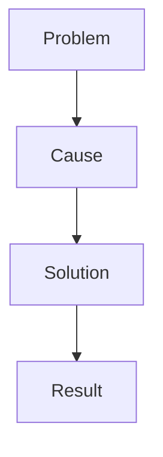

<details>
<summary>📌 Meta · ID: GU-002</summary>

<br>

> **Author:** ThuongDev
>
> **Created:** 2026-07-14
>
> **Context:** Documentation system structure  
> **Status:** Active  
> **Tags:** #system #structure  

</details>

# 📁 Folder Organization Guidelines

> This document defines the folder structure and content organization principles.  
> Detailed conventions such as metadata, file naming, and ID systems are documented separately.

## 🧩 1. `Projects [en]` Folder Organization Rules

Each subfolder represents a single project.

Projects are:

* Numbered starting from `1`
* Named using **PascalCase** (no spaces, each word capitalized)

📌 Example:

```
2.2 Projects [en]/
├── 0. Guides
├── 1. GameOverNight
├── 2. PocketGameWiki
└── 3. SaiGonPho
```

---

The **Guides** folder is always indexed as `0`.

This section covers:

* System rules and conventions
* Writing guidelines
* Structural definitions

Use this folder for content that:

* Is not tied to any specific project
* Does not describe a development process
* Helps maintain or understand the system

📌 Example:

```
0. Guides/
├── 1. Folder Organization Guidelines.md
├── 2. File Naming Rules.md
├── 3. Writing Guidelines.md
└── 4. Folder Structure.md
```

## 🧠 2. Folder Organization Rules for Sub-Projects

The content is organized into folders, that capture not just outcomes, but the **thinking and evolution behind them**.

These sections reflect how a project is developed in practice:

* **Journey** — timeline and narrative
* **Decisions** — key choices and reasoning
* **Solutions** — problem-solving records
* **Strategies** — long-term direction

> 🎯 The goal is to preserve not only the **final results**, but also the **thought process that produced them**.

---

### 🟣 2.1 Journey

#### Purpose

The **Journey** section documents the progression of a project over time.

It functions like a development journal, capturing:

* Actions taken
* Thoughts and considerations
* Events and changes
* Project evolution

---

#### Rules

* Entries are ordered chronologically
* Numbering is for readability only
* Each entry maintains a unique ID in metadata

📌 Example:

```
1. Journey/
├── 1. Reviving GameOverNight.md
├── 2. Rebuilding the Interface.md
└── 3. First Version.md
```

---

### 🔵 2.2 Decisions

#### Purpose

The **Decisions** section records important development choices.

Focus is not only on *what* was chosen, but also:

* Why it was chosen
* Alternatives considered
* Trade-offs (pros and cons)
* Context behind the decision

---

#### Rules

Only document decisions with **long-term impact**.

Avoid logging minor or trivial changes.

✅ Record:

* Choosing Next.js over another framework
* Choosing MySQL over MongoDB
* Architectural changes

❌ Skip:

* Renaming variables
* Minor bug fixes

---

### 🟢 2.3 Solutions

#### Purpose

The **Solutions** section captures how problems were resolved.

Typical structure:



---

#### Rules

Each entry should clearly answer:

* What was the problem?
* What caused it?
* What approaches were tried?
* What was the final solution?

---

### 🟡 2.4 Strategies

#### Purpose

The **Strategies** section defines long-term plans and directions.

Difference from Decisions:

* **Decision** → selecting a specific option
* **Strategy** → planning how to achieve a goal

---

#### Rules

Each strategy should include:

* Goal
* Rationale
* Approach
* Execution plan

---

### 🔗 2.5 Relationships Between Sections

These sections are interconnected and can reference each other:

```
Journey
    |
    ├── Decisions
    ├── Solutions
    └── Strategies
```

📌 Example:

From a Journey entry:

> 15. Decided To Change the Database Architecture.md

Link to:

```
2. Decisions/8. Database Architecture Change.md
```

Or:

> 20. Encountered an API Deployment Issue.md

Link to:

```
3. Solutions/15. Fix API Deployment Issue.md
```

---

✅ Conclusion

🟣 A well-designed system does more than store information.
👉 It preserves the **thinking process behind that information**.